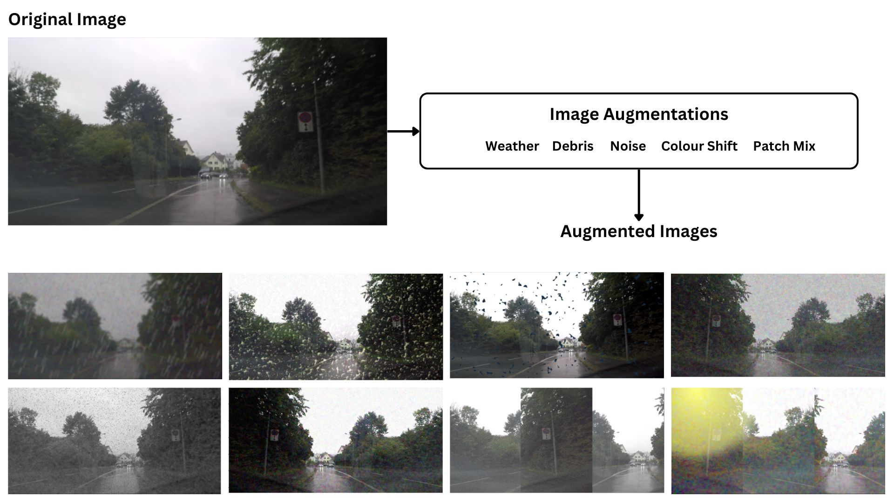

## augmentations.py
Image augmentation is an essential part of training visual neural networks. It helps harden the network to various noise effects during training and helps to reduce data over-fitting. The [albumentations library](https://albumentations.ai/) is used to create different image augmentations effects simulation weather, debris, lens effects, noise, colour shifting, and mixing of image patches

## lidar_depth_fill.py
In order to train the SuperDepth network, we require ground truth depth maps. In real world datasets, ground druth depth maps are acquired by LIDAR scanners, resulting in sparse virtual depth maps created by proejction of 3D lidar points onto in image, where, in most cases, depth data is only available for 5% of pixels. This script creates a fully filled in lidar depth map based on the method [In Defense of Classical Image Processing: Fast Depth Completion on the CPU](https://arxiv.org/abs/1802.00036)

## check_data.py
Script to perform a sanity check on data for processing, ensuring that data is read and that number of ground-truth samples match the number of training images

## load_data.py
Helper class to load multiple datasets, separate data into training and validation splits and extract a Region of Interest (ROI) from images

## benchmark.py
Script to print model layers, number of parameters, and measure inference speed of model at either FP32 or FP16 precision