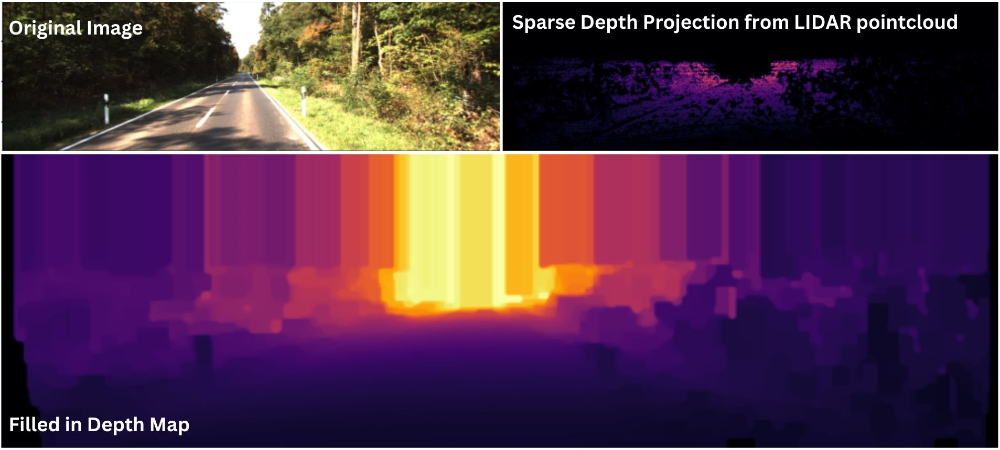

## SuperDepth Dataset
To train the SuperDepth network, a custom dataset was created using a number of open-source, publicly available datasets which capture scene depth through simulation, LIDAR or a combination of LIDAR and Stereo Vision.

The SuperDepth dataset includes RGB images, ground truth depth maps, ground truth height maps, foreground-background object boundary masks as well as sparse depth supervision input. The sparse depth supervision input is calculated either through sparse stereo matching, or by simulating sparse stereo features by analyzing image and depth data.

The datasets used to train SuperDepth include:

- [UrbanSyn](https://www.urbansyn.org)
- [MUAD](https://muad-dataset.github.io/)
- [KITTI](https://www.cvlibs.net/datasets/kitti/eval_depth.php?benchmark=depth_prediction)
- [Driving Stereo](https://drivingstereo-dataset.github.io/)
- [Argoverse 1.0](https://www.argoverse.org/av1.html#stereo-link)
- [MUSES](https://muses.vision.ee.ethz.ch/)
- [Boreas](https://www.boreas.utias.utoronto.ca/#/)
- [DDAD](https://github.com/TRI-ML/DDAD#dataset-details)

## lidar_depth_fill.py
In order to train the SuperDepth network, we require ground truth depth maps. In real world datasets, ground druth depth maps are acquired by LIDAR scanners, resulting in sparse virtual depth maps created by proejction of 3D lidar points onto in image, where, in most cases, depth data is only available for 5% of pixels. This script creates a fully filled in lidar depth map based on the method [In Defense of Classical Image Processing: Fast Depth Completion on the CPU](https://arxiv.org/abs/1802.00036)

